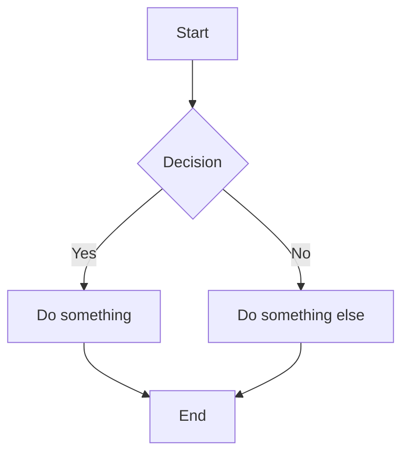
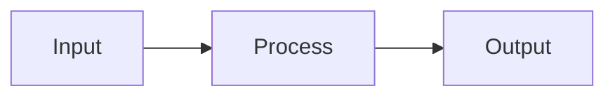
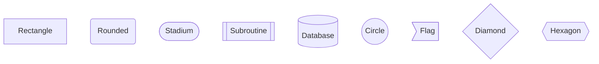
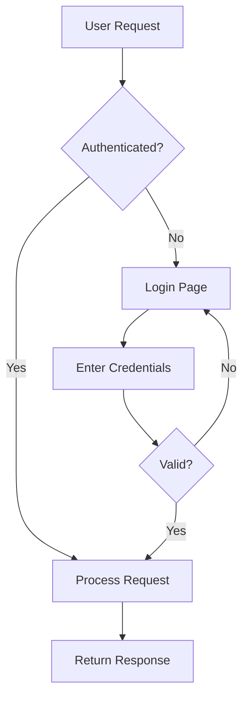
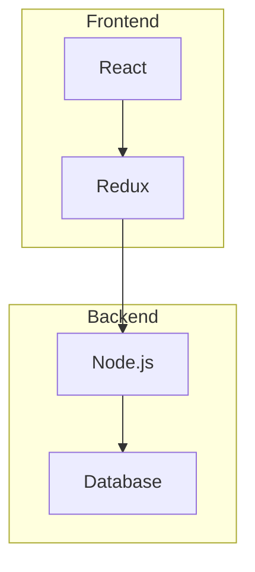

# Mermaid Flowcharts

Mermaid creates diagrams from text.

## Basic Flowchart

```mermaid
graph TD
    A[Start] --> B{Decision}
    B -->|Yes| C[Do something]
    B -->|No| D[Do something else]
    C --> E[End]
    D --> E
```

## Left to Right

```mermaid
graph LR
    A[Input] --> B[Process]
    B --> C[Output]
```

## Node Shapes

```mermaid
graph TD
    A[Rectangle]
    B(Rounded)
    C([Stadium])
    D[[Subroutine]]
    E[(Database)]
    F((Circle))
    G>Flag]
    H{Diamond}
    I{{Hexagon}}
```

## Complex Flow

```mermaid
graph TD
    A[User Request] --> B{Authenticated?}
    B -->|Yes| C[Process Request]
    B -->|No| D[Login Page]
    D --> E[Enter Credentials]
    E --> F{Valid?}
    F -->|Yes| C
    F -->|No| D
    C --> G[Return Response]
```

## Subgraphs

```mermaid
graph TB
    subgraph Frontend
        A[React] --> B[Redux]
    end
    subgraph Backend
        C[Node.js] --> D[Database]
    end
    B --> C
```
