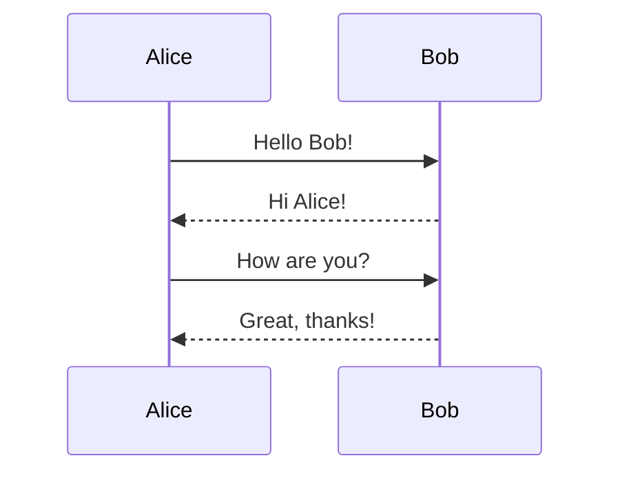
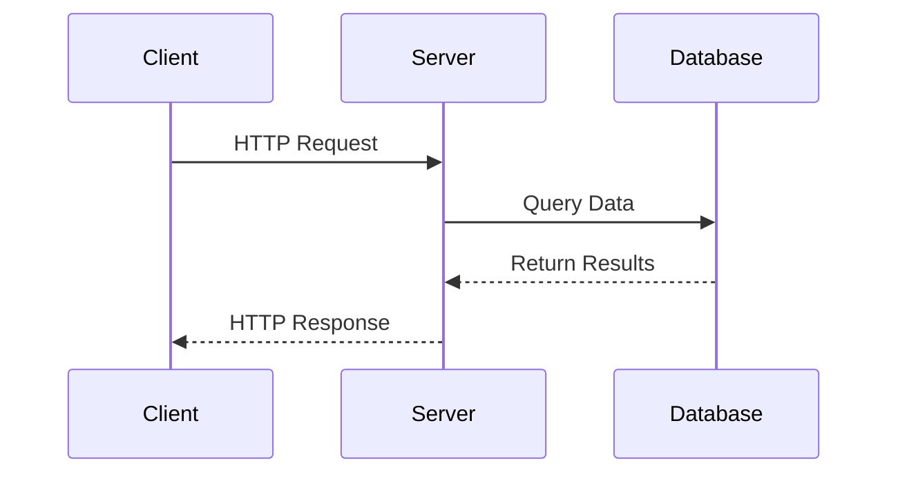
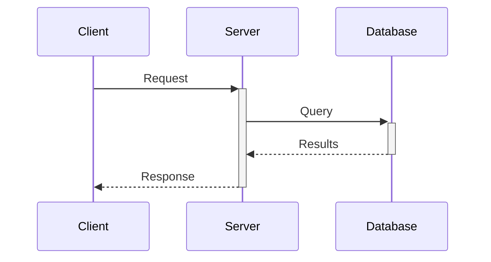
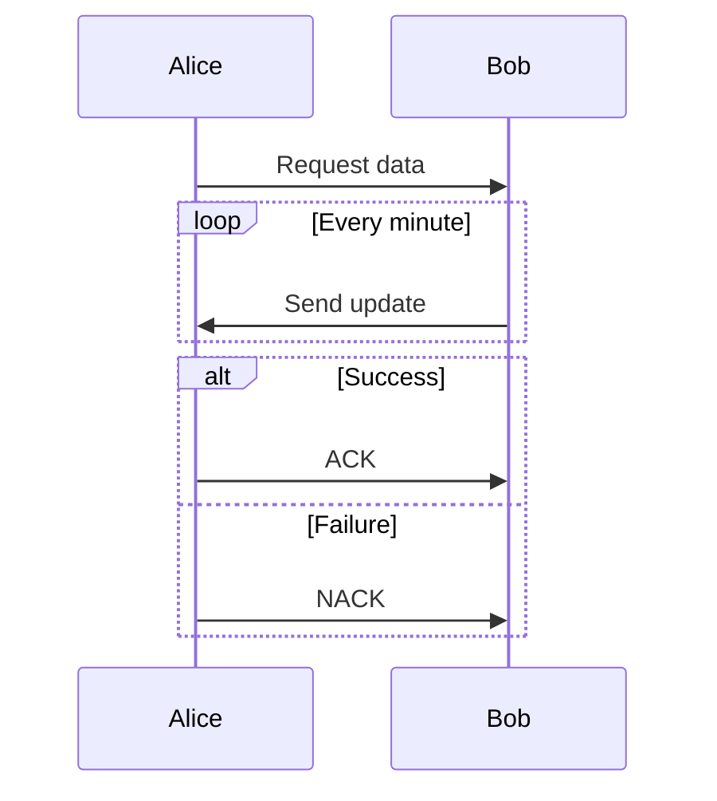
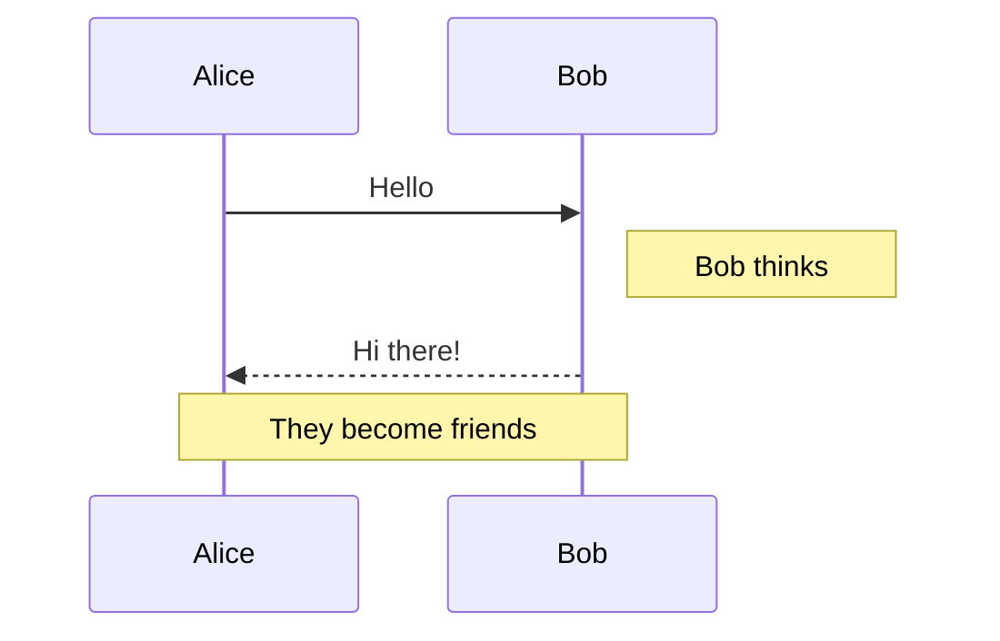

# Mermaid Sequence Diagrams

Sequence diagrams show interactions between participants.

## Basic Sequence

```mermaid
sequenceDiagram
    Alice->>Bob: Hello Bob!
    Bob-->>Alice: Hi Alice!
    Alice->>Bob: How are you?
    Bob-->>Alice: Great, thanks!
```

## With Participants

```mermaid
sequenceDiagram
    participant C as Client
    participant S as Server
    participant D as Database

    C->>S: HTTP Request
    S->>D: Query Data
    D-->>S: Return Results
    S-->>C: HTTP Response
```

## Activation

```mermaid
sequenceDiagram
    Client->>+Server: Request
    Server->>+Database: Query
    Database-->>-Server: Results
    Server-->>-Client: Response
```

## Loops and Conditions

```mermaid
sequenceDiagram
    Alice->>Bob: Request data

    loop Every minute
        Bob->>Alice: Send update
    end

    alt Success
        Alice->>Bob: ACK
    else Failure
        Alice->>Bob: NACK
    end
```

## Notes

```mermaid
sequenceDiagram
    Alice->>Bob: Hello
    Note right of Bob: Bob thinks
    Bob-->>Alice: Hi there!
    Note over Alice,Bob: They become friends
```
