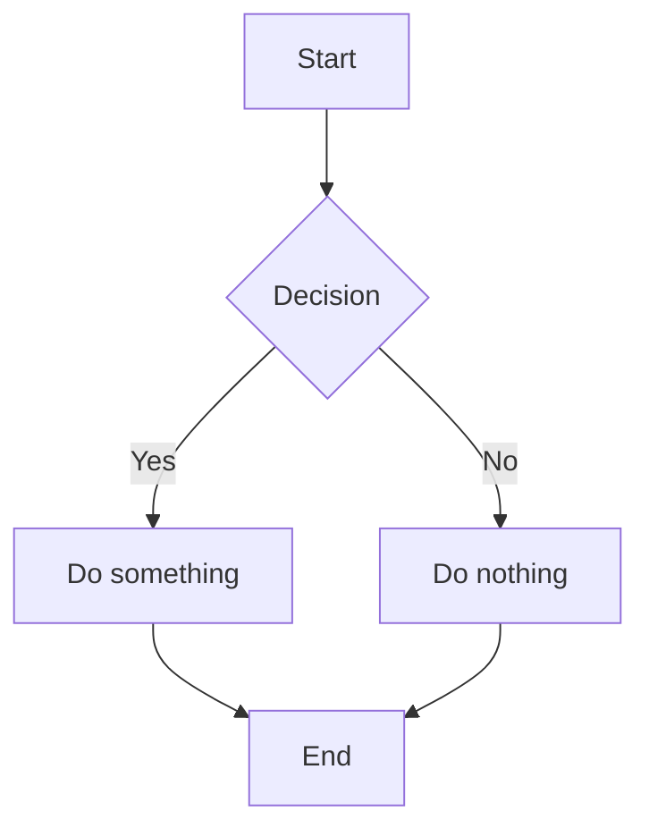
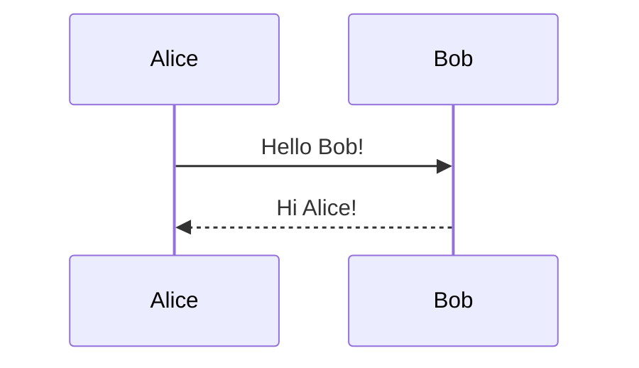

# Markdown Feature Showcase

A comprehensive test of all supported markdown features.

---

## Text Formatting

**Bold text** and *italic text* and ***bold italic***.

~~Strikethrough text~~ for deletions.

==Highlighted text== for emphasis.

Inline `code` with backticks.

---

## Task Lists

- [x] Completed task
- [ ] Incomplete task
- [x] Another done item
- [ ] Todo item

Nested tasks:
- [ ] Parent task
  - [x] Child completed
  - [ ] Child pending

---

## GitHub-Style Alerts

> [!NOTE]
> This is a note. Useful for highlighting important information.

> [!TIP]
> This is a tip. Suggests a helpful approach.

> [!IMPORTANT]
> This is important. Critical information for success.

> [!WARNING]
> This is a warning. Be careful about this.

> [!CAUTION]
> This is a caution. Negative potential consequences.

---

## Footnotes

Here is a sentence with a footnote[^1] reference.

Another reference to a named footnote[^note].

And a third one[^2] for good measure.

[^1]: This is the first footnote.
[^note]: This is a named footnote.
[^2]: The third footnote content.

---

## Bare URL Autolinks

Visit https://github.com for code hosting.

Check out https://anthropic.com for AI research.

Email links work too: support@example.com

---

## Tables (Tufte Markdown)

*Table 1: Basic table with caption above*
| Feature | Status | Notes |
|---------|:------:|-------|
| Tables | Done | Full support |
| Alignment | Done | Left, center, right |

---

### Column Widths

| Name | Description | Price |
|:--{20%}|:--{60%}|--{20%}:|
| Widget | A fantastic widget | $9.99 |
| Gadget | Premium gadget | $19.99 |

---

### Decimal Alignment

| Product | Revenue |
|---------|-------.|
| Alpha | 1,234.56 |
| Beta | 99.99 |
| Gamma | 12,345.00 |

---

### Colspan

| Metric | Q1 2024 | > |
|--------|:-------:|:-:|
|        | Revenue | Users |
| Sales | $1.2M | 45K |

---

### Rowspan

| Category | Item | Price |
|----------|------|------:|
| Fruits | Apple | $1.00 |
| ^ | Orange | $1.25 |
| ^ | Banana | $0.75 |
| Vegetables | Carrot | $0.50 |

---

## Mermaid Diagrams





---

## Inline HTML Tags

Press <kbd>Ctrl</kbd>+<kbd>S</kbd> to save.

This is <mark>highlighted</mark> text.

H<sub>2</sub>O is water. E=mc<sup>2</sup>.

---

## Blockquotes

> This is a regular blockquote.
> It can span multiple lines.

> Nested quotes:
>> Inner quote level.

---

## Code Blocks

```python
def hello():
    print("Hello, World!")

hello()
```
```output:exec-1767375089992-5l8hb
Hello, World!
```

```javascript
const greet = (name) => {
  console.log(`Hello, ${name}!`);
};
```
```output:exec-1767375043562-ifwb1
```

---

## Links and Images

[Regular link](https://example.com)

[Link with title](https://example.com "Example Site")

---

## Lists

Unordered:
- First item
- Second item
  - Nested item
  - Another nested
- Third item

Ordered:
1. First
2. Second
3. Third

---

## Horizontal Rules

---

***

___

---

## Math

Inline math: $$E = mc^2$$

Block math:

$$
\int_{-\infty}^{\infty} e^{-x^2} dx = \sqrt{\pi}
$$

---

## Summary

| Feature | Syntax | Status |
|---------|--------|:------:|
| Task lists | `- [x]` / `- [ ]` | ✅ |
| Highlights | `==text==` | ✅ |
| Alerts | `> [!NOTE]` | ✅ |
| Footnotes | `[^1]` | ✅ |
| Autolinks | `https://...` | ✅ |
| Mermaid | ` ```mermaid ` | ✅ |
| Table captions | `*caption*` | ✅ |
| Column widths | `{30%}` | ✅ |
| Colspan | `>` | ✅ |
| Rowspan | `^` | ✅ |
| Decimal align | `---.` | ✅ |
